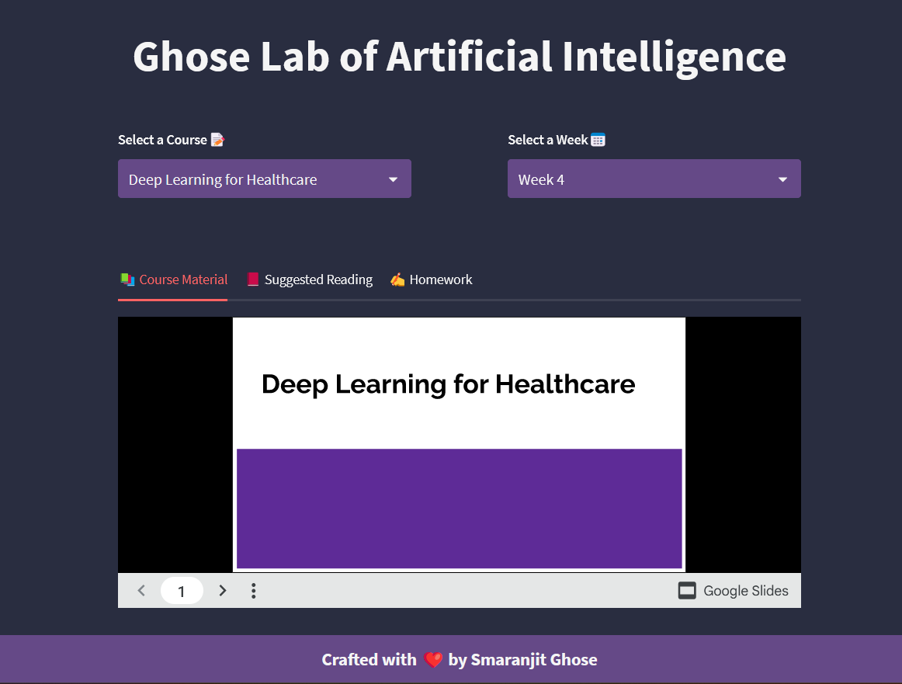
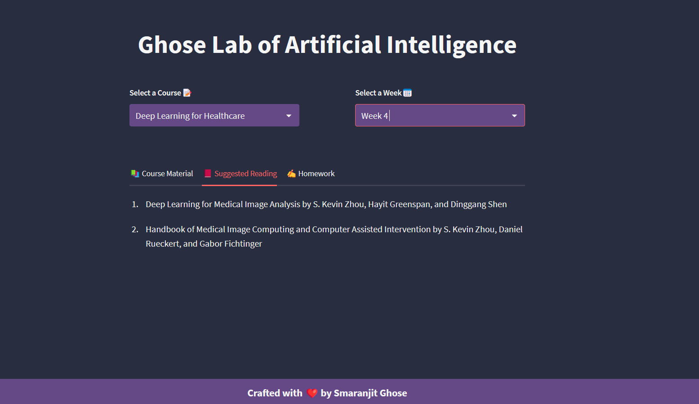

# Ghose Lab of Artificial Intelligence

A super useful Streamlit Application that enables me to efficiently share with students that homeworks, slides, suggested reading for each week of the courses I teach as guest lecturer or freelance trainer.

## 🚀 Demo

**v.0.0.1**


<p align = "center"></p>

<p align = "center"></p>


## ⚒️ Usage

- Open your terminal / command prompt. 

- Clone the repository 
    ```
    git clone https://github.com/smaranjitghose/GhoseAILab.git
    ```
- Change the directory to the cloned project
    
    ```
    cd GhoseAILab
    ```

- Ensure you have [Python](https://www.python.org/downloads/) installed in your system 

- Create a new virtual environment
    ```
    python -m venv env
    ```

- Activate virtual enviroment
    - On Mac/Linux
        ```terminal
        source env/bin/activate
        ```
    - On Windows
        ```terminal
        env/Scripts/Activate.ps1 
        ```

- Install the dependencies
    ```
    pip install -r requirements.txt
    ```
- Start the application
    ```
    streamlit run app.py
    ```


## Data Schema

The data is currently stored on a JSON with the following schema

```js
[
    {
    "course_code": "DLH301",
    "course_name": "Deep Learning for Healthcare",
    "pre-requisites": "........",
    "description": ".....",
    "instructors": ["Smaranjit Ghose"],
    "semester": "Spring 2023",
    "material": [
      {
        "week number": 1,
        "topic": "Introduction to Deep Learning and Healthcare",
        "g_slide": "https://docs.google.com/presentation/d/e/2PACX-1vSpCqGzK4luU4wcOdbWxACQ4JJNXlvMslgWapsQYzW5_YDHqDPVzrIMPCnEwpFvstbcnHqvzHNXfP-4",
        "reading": [
          "Deep Learning by Ian Goodfellow, Yoshua Bengio, and Aaron Courville",
          "Deep Medicine: How Artificial Intelligence Can Make Healthcare Human Again by Eric Topol"
        ]
      },
      {

      }
      .
      .
      .
    ]
    },
    {
    "course_code": "......",
    "course_name" "......",
    .
    .
    .
    .
    },
    .
    .
    {
        ..
        ..
    },
]
```


## 🛡️ License

This project is licensed under the GNU Affero General Public License v3.0 License - see the [`LICENSE`](LICENSE) file for details.

